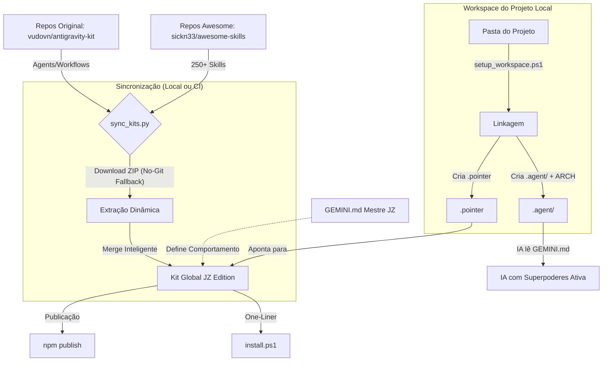

# 📊 Fluxograma de Operação - Antigravity Kit (JZ Edition)

Este documento descreve o fluxo de dados e a arquitetura de funcionamento do kit, desde a instalação até o uso em projetos locais.

---

## 1. Fluxograma Geral

---

## 2. Descrição das Fases

### A. Aquisição e Unificação
O processo começa com o script `sync_kits.py`. Ele é responsável por:
1. Conectar-se aos repositórios originais (Vudovn e sickn33).
2. Baixar as versões mais recentes (suporta ZIP para máquinas sem Git).
3. Unificar as pastas de `agents`, `skills` e `workflows`.
4. Garantir que as regras customizadas do **JZ Edition** (como o `GEMINI.md` com Sequential Thinking) sejam as dominantes.

### B. Distribuição (Acesso Fácil)
Para que o kit seja portátil e fácil de instalar, ele oferece três caminhos:
- **NPM (Em breve):** Para desenvolvedores web via `npx ag-jz init`.
- **PowerShell One-Liner:** Para ambientes Windows nativos via `irm | iex`.
- **Manual/Git:** Clonando o repositório diretamente.

### C. Linkagem (Virtualização do Kit)
Em vez de copiar centenas de megabytes para cada projeto novo, o kit usa um sistema de **Linkagem**:
1. O script `setup_workspace.ps1` cria uma pequena pasta `.agent` no seu projeto.
2. Ele copia apenas o básico para o contexto da IA (Arquitetura e Workflows).
3. Ele cria um arquivo `.pointer` que diz para a IA: *"O resto das minhas habilidades está guardado na pasta global X"*.
4. **Resultado:** Todos os seus projetos usam a mesma base de conhecimento, e atualizá-la uma vez atualiza todos os projetos.

---

## 3. Benefícios da Arquitetura
- **Leveza:** Espaço em disco mínimo por projeto.
- **Sincronismo:** Uma única fonte da verdade para suas regras de IA.
- **Portabilidade:** Funciona em qualquer lugar da máquina do usuário (usando `$HOME`).
- **Resiliência:** Funciona mesmo sem Git instalado.
